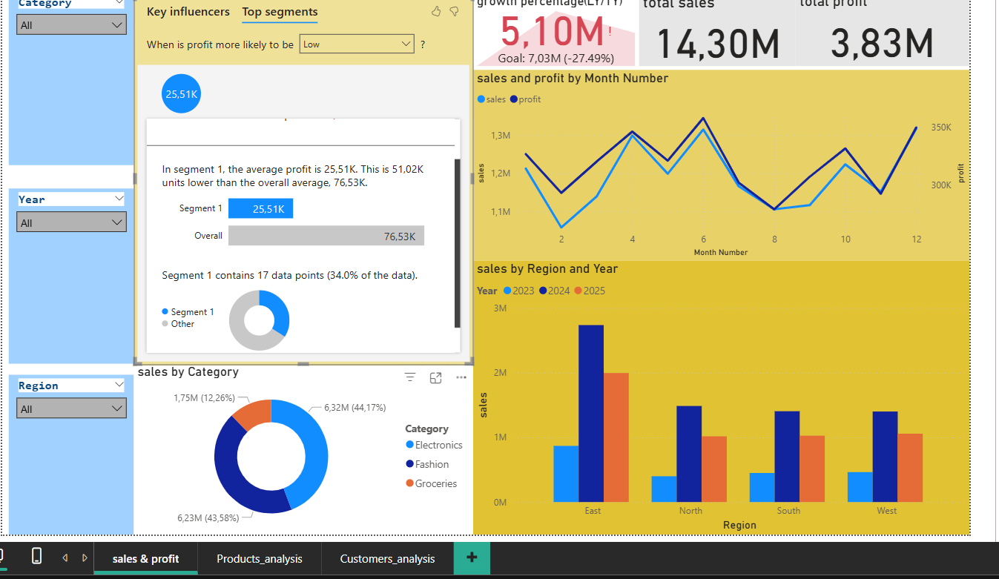
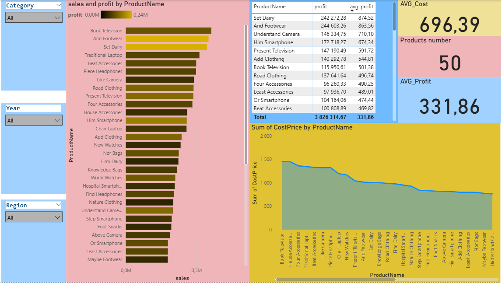
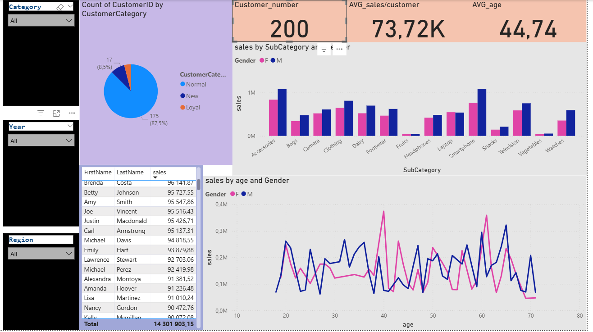

# PowerBI-Retail-Sales-Analysis
Retail Sales Analysis &amp; Business Intelligence Project (2023–2025) – Power BI
# Power BI Retail Sales Analysis & Business Intelligence Project (2023–2025)

**Author:** Adem Toumi  
**Role:** Data Analyst  
**Tools:** Microsoft Power BI

## Project Overview
This project is a full Business Intelligence case study in Power BI, analyzing retail sales performance across 2023–2025. It demonstrates professional data cleaning, modeling, DAX calculations, and dashboard design.

## Key Features
- **Data Cleaning & Preparation:** Corrected date formats, standardized IDs, removed duplicates.
- **Data Modeling:** Star Schema with fact and dimension tables.
- **DAX Measures:** Sales, Sales TY, Sales LY, Profit, Avg Profit per Product, Customer Segmentation.
- **Dashboards:**  
  1. Sales Overview  
  2. Product Insights  
  3. Customer Insights

## Screenshots
  
  

## Business Insights
- Growth dropped by 27% → pricing or marketing strategy needed.  
- Loyal customers (<20%) contribute >60% of sales.  
- Top 10 profitable products should be prioritized.  

## Project Files
The complete project report is available in the `Project-Files` folder:  
[RetailSalesAnalysis.pdf](Project-Files/RetailSalesAnalysis.pdf)
